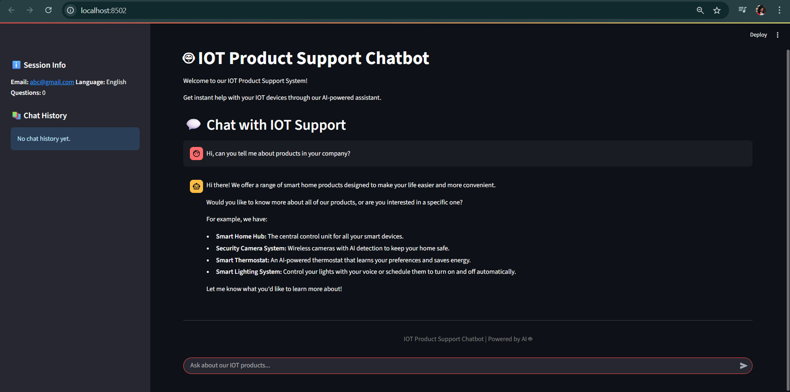

# IOT Product Support Chatbot

A comprehensive AI-powered chatbot system for IOT product support, built with LangChain, Streamlit, and ChatGroq. This system provides intelligent product assistance with user registration, language support, feedback collection, and expert contact integration.

## Features

### Core Functionality
- **User Registration**: Email and phone number collection for session management
- **Language Control**: English and Malay language options with strict language enforcement
- **Smart Product Routing**: LLM-driven intelligent routing to relevant IOT products
- **RAG Pipeline**: Document-based question answering with ChatGroq
- **Automatic Feedback**: Feedback collection after every 3 questions with session termination
- **Expert Contact**: Direct connection to product-specific and overall experts
- **Session Management**: Persistent chat history with automatic session termination

### IOT Products Supported
- **Smart Home Hub**: Central control unit for smart home devices
- **Security Camera System**: AI-powered surveillance with night vision
- **Smart Thermostat**: Intelligent climate control with energy optimization
- **Smart Lighting System**: Automated lighting with voice control

### Language Support
- **English**: Full support with English-only responses
- **Malay**: Full support with Malay-only responses
- **Language Enforcement**: Chatbot responds ONLY in selected language regardless of user input

## Technology Stack

- **Framework**: Streamlit (Web UI)
- **AI/ML**: LangChain (RAG pipeline), ChatGroq (LLM)
- **Vector Database**: FAISS (Fast similarity search)
- **Database**: MySQL (Chat history and feedback storage)
- **Environment**: Conda (Python 3.10)
- **Document Processing**: PyPDF, Sentence Transformers

## Prerequisites

### Required Software
- **Python 3.10**: [Download here](https://www.python.org/downloads/)
- **Conda**: [Installation guide](https://docs.conda.io/en/latest/miniconda.html)
- **MySQL**: [Download here](https://dev.mysql.com/downloads/)

### API Keys (Free)
- **ChatGroq API Key**: [Get free key here](https://console.groq.com/)

## Quick Setup (10 minutes)

### Step 1: Clone and Navigate
```bash
cd iot_support_chatbot
```

### Step 2: Create Conda Environment
```bash
conda create -n iot_chatbot python=3.10
conda activate iot_chatbot
```

### Step 3: Install Dependencies
```bash
pip install -r requirements.txt
```

### Step 4: Set Up Environment Variables
1. Copy the environment template:
   ```bash
   cp env_template.txt .env
   ```

2. Edit `.env` file with your credentials:
   ```env
   # API Keys
   GROQ_API_KEY=your_chatgroq_api_key_here

   # Database Configuration
   MYSQL_HOST=localhost
   MYSQL_USER=root
   MYSQL_PASSWORD=your_mysql_password
   MYSQL_DATABASE=iot_chatbot_db
   MYSQL_PORT=3306

   # Application Settings
   DEBUG=True
   LANGUAGE_SUPPORT=["English", "Malay"]
   FEEDBACK_INTERVAL=3
   ```

### Step 5: Set Up MySQL Database
1. Start MySQL server
2. Database will be created automatically on first run

### Step 6: Add IOT Product Documents
Place your IOT product PDF documents in the `data/iot_products/` directory:
- `smart_home_hub.pdf`
- `security_camera_system.pdf`
- `smart_thermostat.pdf`
- `smart_lighting_system.pdf`

### Step 7: Run the Application
```bash
streamlit run main.py
```

The application will be available at `http://localhost:8501`

## 📸 Screenshots

### User Registration & Language Selection


### Chat Interface


### Product Support Conversation


### Feedback System


### Expert Contact & Session End


## Usage Guide

### User Registration
- **Email**: Required for session tracking
- **Phone**: Required for user identification
- **Language**: Choose between English and Malay (enforced throughout session)

### Chat Interface
- **Ask Questions**: Type natural language questions about IOT products
- **Product Listing**: Say "list all products" to see available products
- **Language Enforcement**: Chatbot responds ONLY in selected language
- **Exit**: Type "exit" to end the session

### Session Flow
1. **Registration**: Enter email, phone, and select language
2. **Chat**: Ask questions about IOT products
3. **Automatic Termination**: After 3 questions, session ends automatically
4. **Feedback**: Quick feedback options (Satisfied/Not Satisfied/Skip)
5. **Expert Contact**: Expert details displayed for further assistance
6. **New Session**: Automatically redirected to start new session

### Feedback System
- **Automatic Prompts**: Feedback requested after every 3 questions
- **Session Termination**: Chat ends automatically after 3 questions
- **Quick Options**: Satisfied, Not Satisfied, or Skip Feedback
- **Expert Contact**: Automatically provided for all feedback types

### Expert Contact
- **Product-Specific**: Each IOT product has a dedicated expert
- **Overall Experts**: General IOT experts for comprehensive support
- **Contact Information**: Name, email, phone, and specialties provided
- **Direct Support**: Connect with experts for detailed technical help

## Configuration

### Application Settings
Edit `config/settings.py` to modify:
- **LLM Model**: Change ChatGroq model (default: gemma2-9b-it)
- **Embedding Model**: Modify HuggingFace embeddings
- **Chunk Size**: Adjust document processing parameters
- **Feedback Interval**: Change feedback frequency (default: 3 questions)
- **Session Timeout**: Modify session duration

### Product Configuration
Edit `config/settings.py` to update:
- **Product Information**: Add/modify IOT products
- **Expert Contacts**: Update product-specific and overall expert information
- **Language Prompts**: Modify language selection prompts

## Database Schema

### Tables Created
- **users**: User registration and preferences
- **chat_sessions**: Session metadata and tracking
- **chat_messages**: Individual chat messages
- **feedback**: User feedback and satisfaction data (no expert details stored)

### Sample Queries
```sql
-- View all users
SELECT * FROM users;

-- Get chat history for a session
SELECT * FROM chat_messages WHERE session_id = 'session_id';

-- View feedback statistics
SELECT satisfaction_rating, COUNT(*) FROM feedback GROUP BY satisfaction_rating;
```

## Testing

### Test Scenarios
1. **User Registration**: Test with valid/invalid email and phone
2. **Language Selection**: Switch between English and Malay
3. **Language Enforcement**: Test that chatbot responds only in selected language
4. **Product Queries**: Ask about specific IOT products
5. **Feedback Collection**: Verify feedback prompts and session termination
6. **Expert Contact**: Test expert contact display
7. **Session Management**: Test session termination after 3 questions

### Sample Test Questions
- "How do I install the Smart Home Hub?"
- "What are the features of the Security Camera System?"
- "How do I troubleshoot my Smart Thermostat?"
- "List all your IOT products"
- "I need help with my Smart Lighting System"

### Language Testing
- **English Session**: Ask questions in any language, verify English-only responses
- **Malay Session**: Ask questions in any language, verify Malay-only responses

## Troubleshooting

### Common Issues

#### Database Connection Error
```
Error: Failed to connect to MySQL
Solution: Check MySQL server is running and credentials in .env
```

#### API Key Issues
```
Error: ChatGroq API key not found
Solution: Add valid API key to .env file
```

#### Document Processing Error
```
Error: No documents found
Solution: Add PDF files to data/iot_products/ directory
```

#### Vector Database Issues
```
Error: Could not load vector databases
Solution: Process documents first using the document processor
```

#### Language Not Enforced
```
Issue: Chatbot responding in wrong language
Solution: Verify language selection and check RAG chain language parameter
```

### Debug Mode
Enable debug mode in `.env`:
```env
DEBUG=True
```

## Performance Optimization

### Vector Database
- **FAISS**: Fast similarity search for document retrieval
- **Chunking**: Optimized text chunking for better context

### Database Optimization
- **Session Cleanup**: Automatic cleanup of expired sessions

## Security Features

### Data Protection
- **Environment Variables**: API keys stored securely in .env
- **Input Validation**: Email and phone number validation
- **Session Management**: Secure session handling with timeouts
- **Database Security**: Parameterized queries to prevent SQL injection

### Privacy
- **User Data**: Minimal data collection (email, phone only)
- **Chat History**: Stored securely in MySQL database
- **Feedback**: Anonymous feedback collection (no expert details stored)

## Deployment

### Local Deployment
```bash
streamlit run main.py
```

### Production Deployment
1. **Environment Setup**: Configure production environment variables
2. **Database**: Set up production MySQL database
3. **Document Processing**: Process all IOT product documents
4. **Monitoring**: Set up logging and monitoring
5. **SSL**: Configure HTTPS for secure communication

### Docker Deployment (Optional)
```dockerfile
FROM python:3.10-slim
WORKDIR /app
COPY requirements.txt .
RUN pip install -r requirements.txt
COPY . .
EXPOSE 8501
CMD ["streamlit", "run", "main.py"]
```

## API Documentation

### ChatGroq Integration
- **Model**: Gemma2-9b-It (fast inference)
- **Temperature**: 0.1 (consistent responses)
- **Max Tokens**: 4096
- **Free Tier**: Available for testing

### LangChain Components
- **RAG Chain**: History-aware retrieval and generation with language control
- **Document Processor**: FAISS-based vector storage
- **Session Manager**: Persistent conversation memory with automatic termination
- **Product Router**: Intelligent query routing

## Contributing

### Development Setup
1. Fork the repository
2. Create feature branch
3. Make changes with detailed comments
4. Test thoroughly
5. Submit pull request

### Code Standards
- **Comments**: Detailed explanations for all functions
- **Error Handling**: Comprehensive exception handling
- **Logging**: Proper logging for debugging
- **Documentation**: Clear docstrings and README updates

## License

This project is open source and available under the MIT License.

## Support

### Getting Help
- **Documentation**: Check this README first
- **Issues**: Report bugs via GitHub issues
- **Logs**: Check application logs for error details
- **Configuration**: Verify .env file settings

### Contact Information
- **Technical Support**: Check expert contacts in the application
- **Documentation**: Refer to inline code comments
- **Community**: Join our developer community


## Roadmap

### Future Enhancements
- **Multi-language Support**: Additional languages beyond English/Malay
- **Voice Integration**: Voice input and output capabilities
- **Advanced Analytics**: Detailed usage and feedback analytics
- **Mobile App**: Native mobile application
- **API Endpoints**: RESTful API for external integrations
- **Advanced RAG**: Enhanced document processing and retrieval

---

**Built using Streamlit, LangChain, and ChatGroq** 